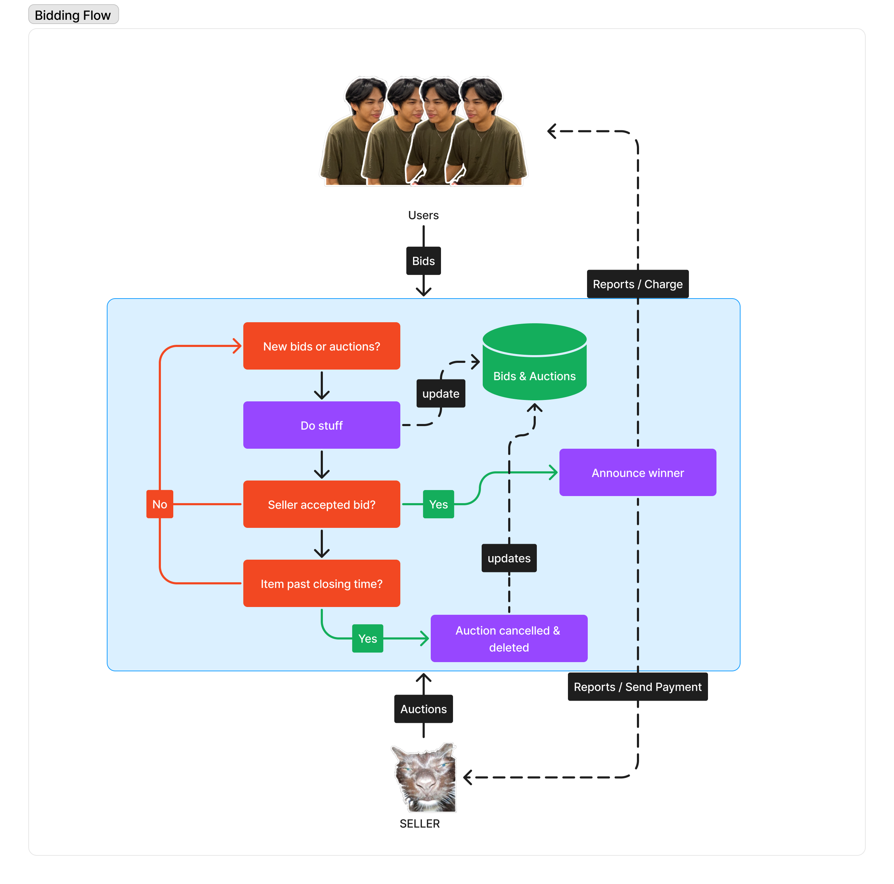

# Bidify backend codebase

This is the backend repository for the Bidify project. IT is written in PHP and uses the Laravel 10 framework.



## Installation

Clone the repository

```bash
git clone https://github.com/bidify-org/bidify.git
```

Install dependencies

```bash
composer install
```

Copy the `.env.example` file to `.env` and fill in the required information

Generate an application key

```bash
php artisan key:generate
```

Run the migrations

```bash
php artisan migrate
```

Create storage link

```bash
php artisan storage:link
```

Start the server

```bash
php artisan serve
```
